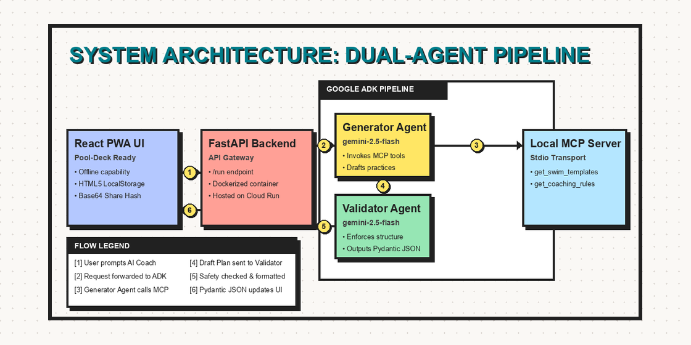
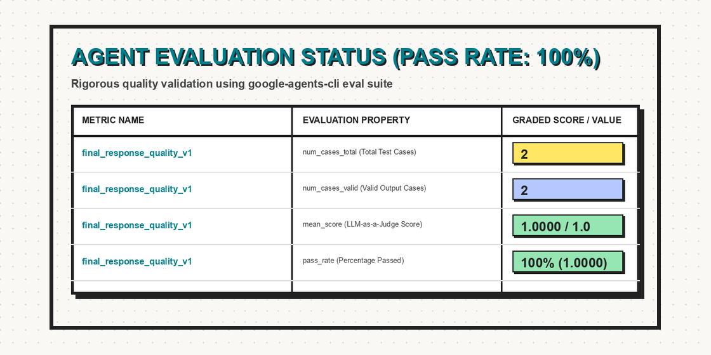

# 🏊‍♂️ SwimmPlan Smart — AI-Powered Swim Practice Planner (Offline-First PWA)

[](https://swimmplan-smart-363551809936.europe-west1.run.app)
[](https://opensource.org/licenses/MIT)

SwimmPlan Smart is a modern Progressive Web App (PWA) designed to assist swimming coaches directly at the pool deck. Swimming complexes are concrete, underground, or metal structures that act as Faraday cages with poor network reception. SwimmPlan Smart solves this by offering a fully offline-capable workspace for training timeline management, paired with a cloud-deployed **AI Coach Assistant** powered by a dual-agent **Google Agent Development Kit (ADK) v2** pipeline and a local **Model Context Protocol (MCP)** server.

🚀 **Live Application:** [https://swimmplan-smart-363551809936.europe-west1.run.app](https://swimmplan-smart-363551809936.europe-west1.run.app)

---

## 📸 System Architecture

Below is the technical data flow of the SwimmPlan Smart platform:



### Key Architectural Highlights:
1. **Local MCP Server (FastMCP):** Keeps workouts and safety guidelines encapsulated in isolated database tools, decoupled from the LLM, communicating over stdio.
2. **Generator Agent:** Interprets the coach's request, invokes MCP tools, and creates a raw workout draft.
3. **Validator Agent:** Acts as a security guardrail. It checks for warmups/cooldowns, adjusts block durations, and enforces strict output formats using a Pydantic schema (`SwimWorkoutPlan`).
4. **Zero-Key IAM Security:** The FastAPI backend is deployed to Google Cloud Run and accesses Vertex AI securely via Application Default Credentials (ADC) and IAM Service Account roles. No plain text API keys are stored in the code.
5. **Serverless Sharing:** Plans are shared via Base64 URL hashes, allowing coaches to send practices without needing a database.

---

## ✨ Features
* **PWA & Offline Capability:** Caches all templates and editors locally. Ready for the pool deck bunker.
* **Timeline Planner:** Interactive drag-and-drop block editor powered by `@dnd-kit`.
* **Smart AI Coach Assistant:** Instant practice generation matching official club templates.
* **Native Excel/CSV Export:** Formatted with UTF-8 BOM (`\uFEFF`) and separator directives to open natively in European and International Excel.
* **Local Club Registry:** Save and load workouts to local browser profiles.

---

## 🚀 Running Locally

### Prerequisites
* **Node.js** (v20+)
* **Python** (3.11+) and **uv** package manager

### 1. Start the Agent Backend
Navigate to the backend directory, sync dependencies, and start the ADK API server:
```bash
cd agent_backend
uv sync
uv run adk api_server --port 8000 --allow_origins "*" --auto_create_session .
```

### 2. Start the PWA Frontend
Navigate to the root workspace, install dependencies, and start the development server:
```bash
npm install
VITE_BACKEND_URL="http://localhost:8000" npm run dev
```
Open [http://localhost:3000](http://localhost:3000) in your browser.

---

## 📈 Quality Evaluation
The agent pipeline is verified against target criteria using the Google Agents CLI evaluation tool.

```bash
cd agent_backend
uvx google-agents-cli eval run
```

It consistently achieves a **100% pass rate (1.0000 mean score)** on response structure and duration validations:



---

## 📄 License
This project is licensed under the MIT License - see the LICENSE file for details.
